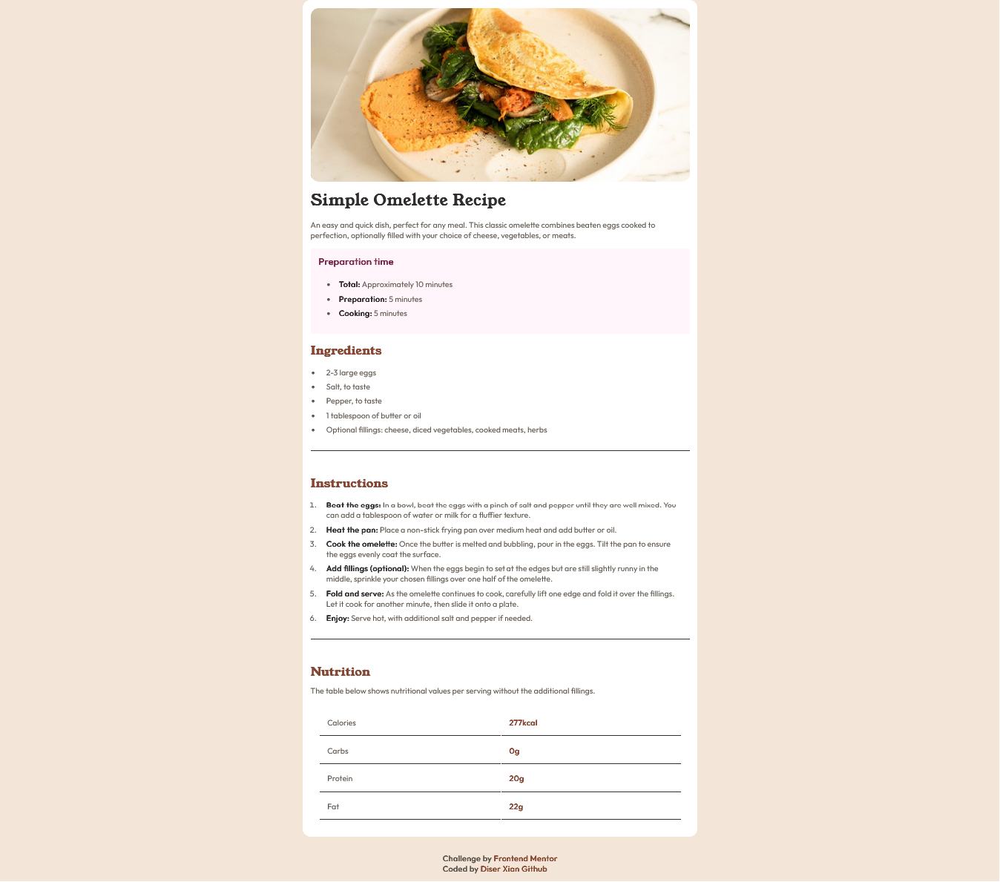

# Frontend Mentor - Recipe page solution

This is a solution to the [Recipe page challenge on Frontend Mentor](https://www.frontendmentor.io/challenges/recipe-page-KiTsR8QQKm). Frontend Mentor challenges help you improve your coding skills by building realistic projects. 

## Table of contents

- [Overview](#overview)
  - [The challenge](#the-challenge)
  - [Screenshot](#screenshot)
  - [Links](#links)
- [My process](#my-process)
  - [Built with](#built-with)
  - [What I learned](#what-i-learned)
  - [Continued development](#continued-development)
  - [AI Collaboration](#ai-collaboration)
- [Author](#author)

## Overview

This project is a solution to the Frontend Mentor Recipe Page challenge. The goal was to build a clean, responsive recipe layout based on a provided design.

The page focuses on presenting structured content such as ingredients, instructions, and nutritional information using semantic HTML. Special attention was given to layout consistency, spacing, and typography to closely match the design.

The implementation follows a mobile-first approach and ensures the layout adapts properly across different screen sizes.

### Screenshot

### Links

- Solution URL: [https://www.frontendmentor.io/profile/Diser-Xian](https://www.frontendmentor.io/profile/Diser-Xian)
- Live Site URL: [https://diser-xian.github.io/RecipePage-Project/](https://diser-xian.github.io/RecipePage-Project/)

## My process
- I started by structuring the HTML using semantic elements to organize the content clearly. Sections like the recipe description, preparation time, ingredients, instructions, and nutrition were separated for better readability and maintainability.

- Next, I applied base styles and CSS variables for colors, spacing, and typography. I followed a mobile-first approach, styling for smaller screens first and then adjusting for larger viewports.

- I then focused on layout and alignment using Flexbox and basic CSS techniques to match the design. Tables were used for structured data like nutrition, ensuring proper semantics and accessibility.

- During development, I tested frequently and fixed issues related to spacing, list alignment, and inconsistent rendering (such as `
` behavior across zoom levels).

- Finally, I refined the UI by improving spacing, typography, and overall visual consistency.

### Built with 
- Semantic HTML5 markup
- CSS custom properties (variables)
- Flexbox
- CSS Grid
- Mobile-first workflow
- Responsive design principles

### What I learned
During this project, I improved my understanding of semantic HTML and how proper structure improves readability and accessibility. Using elements like `<section>`, `<article>`, and `<table>` helped organize the content more clearly instead of relying on generic `
` elements.

I also learned how to control layout and spacing using CSS, especially with lists, tables, and horizontal rules. One key issue I encountered was inconsistent rendering of `
` when zooming, which I solved by switching from height-based styling to border-based styling for better stability.

Another important takeaway was using CSS custom properties (`:root`) to manage colors and spacing, making the design easier to maintain and update.

Overall, I gained better control over styling details such as spacing, alignment, and responsiveness using a mobile-first approach.

### Continued development

In future projects, I want to focus more on improving responsive design, especially making layouts adapt better across different screen sizes without breaking structure.

I also plan to deepen my understanding of accessibility, particularly using ARIA roles and improving keyboard navigation.

Another area I want to improve is writing cleaner and more scalable CSS, including better use of naming conventions and layout systems like CSS Grid for more complex designs.

Lastly, I want to refine my debugging skills to identify layout and rendering issues faster.

### AI Collaboration

I used AI tools such as ChatGPT to assist with debugging CSS issues, understanding semantic HTML structure, and improving styling techniques.

AI was particularly helpful in identifying problems with CSS behavior, such as incorrect selectors, invalid properties, and layout inconsistencies. It also helped clarify best practices for structuring tables, handling spacing, and using modern CSS features like custom properties.

What worked well was using AI for quick problem-solving and explanations of concepts I didn’t fully understand. However, I made sure to test and validate all suggestions to ensure they worked correctly in my project.

Overall, AI acted as a support tool to speed up learning and debugging, rather than replacing the development process.

## Author

- Github - [Diser-Xian Github](https://github.com/Diser-Xian/RecipePage-Project)
- Frontend Mentor - [@XDEV](https://www.frontendmentor.io/profile/yourusername)
